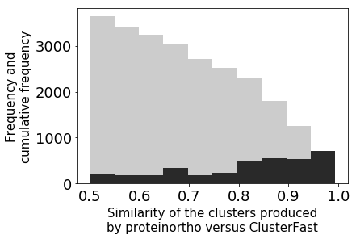

# About

ClusterFast is a scalable, rapid and (CPU and memory) efficient command-line interface for the clustering of orthologous proteins encoded in multiple genomic samples. ClusterFast was developed by the MiDEP group at the [Malawi Liverpool Wellcome Trust Clinical Research Programme](http://www.mlw.medcol.mw/) (members of [H3ABionet](http://www.h3abionet.org/)), after they became frustrated by the long run time and large memory requirements of avaliable clustering programs.

ClusterFast works by first grouping the most similar protein sequences encoded between a random pair of genomes (files) within the input dataset, then choosing the longest sequence for further comparison to protein sequences selected from another pair of genomes until only one file remains. This is then used to identify less similar distantaly related sequences. The tool is suitable for use with both prokaryotic and eukaryotic genomes. By employing this novel approach, ClusterFast substantially reduces the memory and processing time required for the clustering of orthologous proteins compared to other avaliable programs.

Using a test dataset of 140 pneumococcal genomes (each 2.5Mbp in size and encoding ~1500 genes), ClusterFast successfully executed in ~5 minutes on a single core. Using a test dataset of 62 bacterial genomes composed of multiple different specieis, ClusterFast excecuted in ~1 hour on 20 cores.

ClusterFast is written in Python and uses PBLAT (multicore BLAT), BLAST and the ProteinOrtho4.0 algorithm.

# External tools

_Expected to be in system path or provided in the options_

-   [PBLAT](http://icebert.github.io/pblat/)
-   NCBI BLAST suit

# Python and module dependencies

There are a number of dependencies required for ClusterFast, with instructions specific to the type of system you have:

-   Python 3+ (Python2+ not tested)
-   NumPy
-   SciPy
-   Pandas
-   Click
-   BioPython
-   NetworkX

_Modules should be installed by ClusterFast installation._

# Installation
_Note: user might need to be the root_

## Suggested method
>pip install git+<https://github.com/codemeleon/ClusterFast.git>

## Alternative method

1.  git clone <https://github.com/codemeleon/ClusterFast.git>
2.  cd ClusterFast
3.  python setup.py install

If the installation fails, please contact your system administrator. If you discover any bugs, please let us know by emailing anmol@liv.ac.uk

# Input Files

The input format for ClusterFast is protein sequence files (extension .faa) of translated amino acid sequences of predicted open reading frames for each genome (sample) in the input dataset. The file and/or sequence names must not contain  **___(three underscores)**. These files can be created using [Prokka](https://github.com/tseemann/prokka).

# Usage

clusterfast -faaf < protein_seq_folder > -identity < sequence_similarity > -ncor < #_of_cores_to_use > -outfile < outputfile > -pblat < pblat_absolute_path > -blastp < blast_absolute_path > -makeblastdb < makeblastdb_path > -sim_algo < blat|anm > -minlen < minmum_sequence_size_for_clustering > -mindiff < Sequence_difference_in_pair_sequenc > -minmap < Minimum_map_length_relative_to_longer_sequence_in_pair > -seed < random_number_for_file_pairing >

-   --help/-h : Help
-   -faaf: Folder containing protein fasta files with file extension **.faa**
-   -identity: Similarity between sequences. Defaults: 0.8 for closly related samples and 0.25 for distantly related samples
-   -ncor: Number of processors to use
-   -outfile: Output file path
-   -pblat: Path for pblat executable. Default: pblat
-   -makeblastdb: Path for makeblastdb executable. Default: makeblastdb
-   -blastp: Path for blastp executable. Default: blastp
-   -evalue: BLAST evalue. Default: 1e-10
-   -distant: Are samples distantly related? Default: False
-   -seed: For random file pairing. Default: 1234
-   -minlen: Minimun length of sequences used in clustering. Default: 50
-   -mindiff: Length of smaller sequences relative longer, to consider a blast hit. Default: 0.5
-   -minmap: Minimum mapping length relative to the longer sequence in the pair. Default: 0.5
-   -conn_threshold: Connection threshold used in ProteinOrtho4.0. Default: 0.1
-   -adaptive: Adapative search value as in ProteinOrtho4. Default: 0.95
-   -algo: For different Identity calculation method. Default: anm

    -   **blast**: 2*matches/(sum of length of sequences)
    -   **anm**: matches/tolal alignment length as following.

    -   "*" represents matches in the alignment. Total alignment length includes overhanging sequences, gaps in two sequences, mismatches and matches
    -   `ADGTHADT--FGGHJJ---DFGDTJHKJLKSDFHKJLJ`
    -   `---*****--******---***-**--******-----`
    -   `---THADTFGFGGHJJSDFDFGFTJKHJLKSDF-----`

# License

GPLv3

# Benchmarking

The benchmarking was performed comapare to ProteinOrtho4.0 on two different datasets

## [Kulohoma BW _et.al_](https://www.ncbi.nlm.nih.gov/pubmed/26259813)

-   140 _S. pneumonia_ samples
-   ~1600 protein sequences per samples
-   20 Cores
-   ProteinOrtho4.0 : ~8 hours
-   ClusterFast : 5 Minutes (~100 times faster)
-   more than 90 % similarity

## [62 Different bacterial genome](62BactrialSamples.md)

-   20 Cores
-   2100 to 4500 protein sequences per genome
-   Protein Ortho ~4 hours
-   Clusterfast: ~1 hours (4 times faster)
-   ~70% identical clusters
-   ~20%  cluster between ProteinOrtho4. and ClusterFast had
-   ~70% indetical clusters among two tools

Figure 1:  Shows a direct comparison of the number of orthologous amino acid sequences present in the clusters produced by ClusterFast compared to those produced by ProteinOrtho. A linear relationship can be observed between the two. The size of the data points indicates the degree of overlap in the protein IDs assigned to the amino acid sequences in each ClusterFast versus ProteinOrtho cluster; the larger the data point the higher the degree of overlap.

Figure 2: Shows the frequency (dark grey) and cumulative frequency (light grey) of the non-overlapping clusters of a given content percentage similarity produced by ClusterFast compared to ProteinOrtho. All of the clusters showed >50% content similarity.

# Request

All improvement suggestions and critics are welcome.

# ToDo

-   Py27 compatible
-   More optimisations
